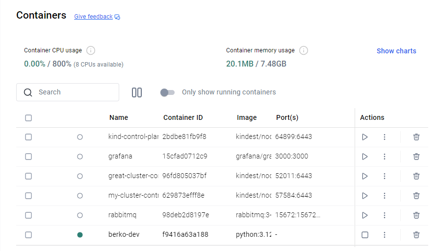
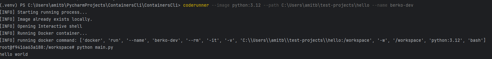
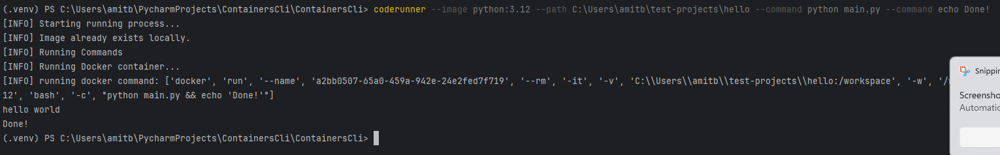

# 🐳 CodeRunner CLI

A lightweight command-line tool that runs local code inside Docker containers with automatic image management and workspace mounting.

It allows developers to execute code in isolated environments without installing language runtimes locally.

---

## ✨ Features

- 🚀 Run code inside any Docker image (Python, Node.js, Go, etc.)
- 📁 Automatic mounting of local project directories into containers
- 📦 Auto-pull Docker images if missing locally
- 🧑‍💻 Interactive mode (open shell inside container)
- ⚡ Run single commands or multiple-step workflows
- 🧪 Validation of environment (Docker, paths, etc.)

---

## 📦 Project Structure

```text
ContianerCli/
│
├── ContianerCli/
    coderunner/
  │   ├── __init__.py
  │   ├── main.py
  │   ├── cli.py
  │   ├── docker_runner.py
  │   ├── validation.py
  │   ├── utils.py
  │   └── logger.py
│
├── pyproject.toml
├── .gitignore
└──README.md
```

---

## ⚙️ Requirements

- Python 3.10+
- Docker installed and running
- pip

---

## 📥 Installation

```bash
pip install -e .
```

---

## 🚀 Usage

### Interactive mode

```bash
coderunner --image python:3.12 --path .
```

### Run command

```bash
coderunner --image python:3.12 --path . --command python main.py
```

### Multiple commands

```bash
coderunner --image python:3.12 --path . \
  --command pip install -r requirements.txt \
  --command pytest \
  --command python main.py
```
---

## 🧱 How It Works

1. Parse CLI arguments
2. Validate environment
3. Pull Docker image if needed
4. Mount project directory into `/workspace`
5. Run command or open shell

---

## 🧰 CLI Options

| Flag | Description |
|------|------------|
| --image | Docker image to use, if not exists on the machine the project will pull it automaticllay |
| --path | Local project path |
| --command | Command(s) to run |
| --name | Set name to the created container |

---

## 🚀 Future Improvements
- config file support (.coderunner.yml)
- environment variables
- prettier logs (Rich)

## Real Exampke
 Let's say I have python files, called main.py in the following path
 ```bash
 C:\Users\amitb\test-projects\hello
 ```
 The only written code in the file is a simple:
 ```python
 print("Hello World")
 ```

We can run the following application with two commands:

- Run Command inside a container
```bash
coderunner --image python:3.12 --path C:\Users\amitb\test-projects\hello --name berko-dev
```

This will create a container called berko-dev in our docker <br/>
 <br />
and will open for us the container's terminal to run commands in <br/>


- Run command with the cli
<br />
Let's say we want to run the main.py file and print Done! when we finished <br/>
We can simply do that with the following command
```bash
 coderunner --image python:3.12 --path C:\Users\amitb\test-projects\hello --command python main.py --command echo Done!
```
The output will be as follows:
